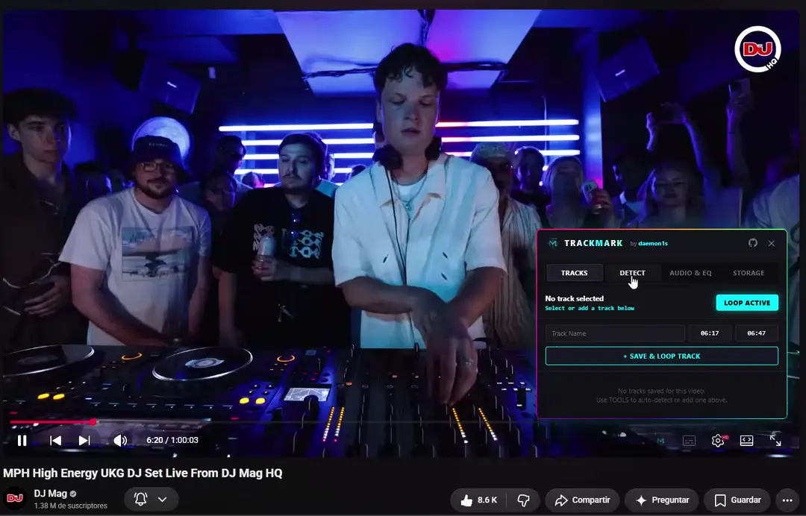

<p align="center">
  
</p>

<h1 align="center">TRACKMARK</h1>

<p align="center">
  <strong>YouTube Track & Segment Looper • 6-Band Graphic Equalizer • Auto-Detect Metadata</strong>
</p>

<p align="center">
  
  
  
  <a href="https://www.virustotal.com/gui/file/e08e0c564d0d6f3749656bd3ec066e469b20893558f79b77e1147e0c7386f85c" target="_blank">
    
  </a>
  
</p>

---

## 🎬 Demo

<p align="center">
  
</p>

## ✨ Features

- ⚡ **Precision Track Looping**: Seamless, zero-gap looping with timestamp precision directly inside YouTube's HTML5 player.
- 🎛️ **6-Band Graphic Equalizer**: Web Audio API cascade (60Hz, 150Hz, 400Hz, 1kHz, 2.4kHz, 15kHz) with built-in presets (Bass Boost, EDM, Rock, Pop, Hip-Hop, Vocal Clarity) that persist globally across videos.
- 🔊 **Volume Booster**: Amplify audio up to 600% above YouTube's native maximum with a clipping limiter, with quick presets (100% - 600%) that persist globally.
- 📋 **1-Click Auto-Detect Tracklist**: Extracts all song titles and timestamps from video descriptions and top comments automatically.
- 📌 **Interactive Timeline Markers**: Visual markers and active loop highlights overlaid directly on the native YouTube progress bar.
- 🔍 **Quick Search Integrations**: Direct YouTube and SoundCloud search buttons next to every song timestamp without restarting playback.
- 🪟 **Draggable & Isolated UI**: Shadow DOM container with fluid header dragging that never leaks styles or interferes with native YouTube shortcuts.
- 💾 **100% Local & Private**: All timestamps and presets are stored offline in `chrome.storage.local`. Includes instant JSON Export/Import for backup.

---

## 🚀 Quick Install (Load Unpacked)

### Option 1: Download Release (.ZIP)

1. Download the latest **`TrackMark-v1.2.0.zip`** from [Releases](https://github.com/daemon1s/trackmark/releases).
2. Extract the `.zip` file into a folder on your PC.
3. In Google Chrome, go to `chrome://extensions/`.
4. Turn on the **Developer mode** toggle in the top-right corner.
5. Click the **Load unpacked** button and select the extracted folder.
6. Open any YouTube video and click the **TrackMark (TM)** icon in the player controls!

---

### Option 2: Build from Source

```bash
# Clone repository
git clone https://github.com/daemon1s/trackmark.git
cd trackmark

# Install dependencies
npm install

# Build extension
npm run build
```

Then load the `dist/` folder into `chrome://extensions/` with **Load unpacked**.

---

## 🛠️ Architecture & Web Audio Graph

```
YouTube HTML5 Video (MediaElementSource)
  │
  ▼
[60Hz LowShelf] ──► [150Hz Peaking] ──► [400Hz Peaking] ──► [1kHz Peaking] ──► [2.4kHz Peaking] ──► [15kHz HighShelf]
  │
  ▼
[GainNode (1.0x)]
  │
  ▼
[DynamicsCompressorNode (Limiter to prevent clipping)]
  │
  ▼
AudioDestination (Hardware Output)
```

---

## 👤 Author

Developed by **[daemon1s](https://github.com/daemon1s)**

---

## 📄 License

MIT License © 2026 [daemon1s](https://github.com/daemon1s)

